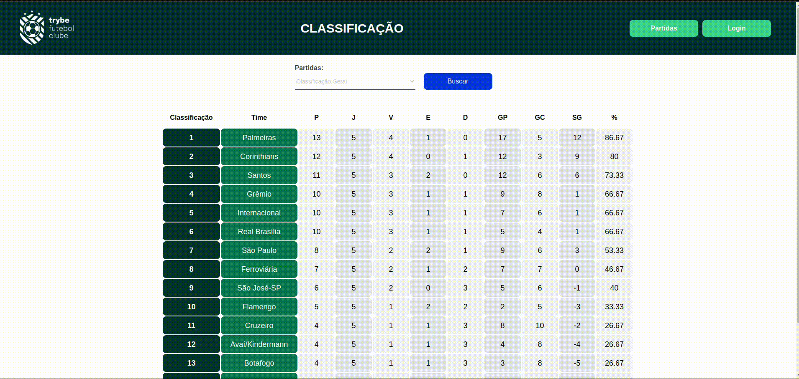

# <h1 align="center">⚽ football-leaderboard ⚽</h1>
<fig>

</fig>

 <details>
    <summary><strong>🏻‍❗ Resalvas</strong></summary><br />

- O frontend desse projeto é de total autoria da Trybe(https://www.betrybe.com/);
- Minha tarefa foi apenas construir o backend, a fim de se tornar uma aplicação completa;

  </details>

## Inicialização
Para executar o projeto, utilize as ferramentas descritas na sessão *Ferramentas*.

## Ferramentas
* NPM - Gerenciador de pacotes padrão para execução do JavaScript Node.js
* Docker - Conjunto de produtos de plataforma como serviço que usam virtualização de nível de sistema operacional.
* Docker Compose - Ferramenta usada para definir e executar aplicativos de vários contêineres do Docker
```bash

# Faça o clone
$ git clone git@github.com:sergioruza/football-leaderboard.git

# Acesse a pasta
$ cd football-leaderboard

# Instale as dependências do front-end e back-end
$ npm run install:apps

# Suba os contêineres
$ npm run compose:up
# backend logs
# [nodemon] starting `ts-node ./src/server.ts dev`
# Running on port 300?  

# frontend logs
#You can now view frontend in the browser.
#  Local:            http://localhost:300?

# Vá até a pasta backend e popule o banco
$ cd app/backend
$ cd npm run db:reset

```
# football-leaderboard

## Introdução

Este projeto possui o objetivo principal de criar o backend de uma aplicação e,
com os objetivos gerais de firmar conhecimentos em nodeJS com Sequelize, POO e tests.

## Análise técnica

### Descrição do ambiente técnico

O sistema é composto de um backend. Linguagem, frameworks e bibliotecas principais na qual utilizei para a criação:
> Back-End
* **F1** - TypeScript.
* **F2** - Node.
* **F3** - Sequelize.
* **F3** - MySQL.
* **F4** - POO com alguns pilares do SOLID.
* **F5** - MochaJS.

### Requisitos Funcionais
Respeitando a proposta, o sistema deverá atender os seguintes requisitos:

* **RF1** - Desenvolver o backend capaz de se comunicar com o frontend;
* **RF2** - Rotas:
                   * get /teams: Retorna todos os times;  
                   * post /login: Permite o login de acordo com regras de negócio;  
                   * get /login/role: Retorna quem é o usuário(admin ou user);  
                   * get /matches: Retorna todas as partidas de futebol criadas;  
                   * get matches?inProgress=false: Retorna todas as partidas de futebol criadas e já finalizadas;  
                   * get matches?inProgress=true: Retorna todas as partidas de futebol criadas e em andamento;  
                   * patch /matches/id/finish: Atualiza uma partida de modo que seja dada como finalizada;  
                   * patch /matches/id: Atualiza o numero de gols de uma partida em andamento;  
                   * get /leaderboard/home: Retorna os dados dos times que jogaram em casa;  
                   * get /leaderboard/away: Retorna os dados dos times que não jogaram em casa;  
                   * get /leaderboard: Retorna todos os dados de cada um dos times;  

## Finais
<details>
 <summary><strong>:memo: Objetivos de Aprendizado</strong></summary><br />

- Construir um back-end dockerizado utilizando modelagem de dados através do Sequelize;

- Respeitar regras de negócio providas no projeto;

- Firmar conhecimentos em POO usando TypeScript;

- Firmar conhecimentos em testes utilizando MochaJS;

</details>


